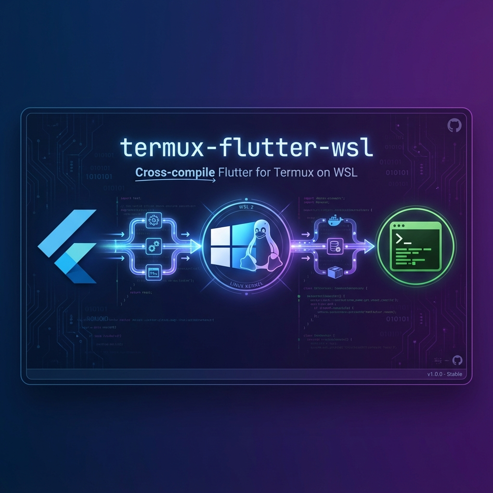

<p align="center">
  
</p>

<h1 align="center">termux-flutter-wsl</h1>

<p align="center">
  <strong>在 WSL 環境下為 Termux 交叉編譯 Flutter SDK</strong>
</p>

<p align="center">
  <strong>中文</strong> | <a href="README_EN.md">English</a>
</p>

<p align="center">
  
  
  
  
  
</p>

<p align="center">
  <em>🍴 Forked from <a href="https://github.com/mumumusuc/termux-flutter">mumumusuc/termux-flutter</a></em>
</p>

---

## 📖 專案簡介

本專案基於 [mumumusuc/termux-flutter](https://github.com/mumumusuc/termux-flutter)，實現了在 **WSL (Windows Subsystem for Linux)** 環境下為 Termux 交叉編譯 Flutter Engine 的完整解決方案。

### 🆚 與原專案的差異

| 項目 | 原專案 | 本專案 |
|---|---|---|
| 構建環境 | Linux / Termux 原生 | **WSL (Windows)** |
| Flutter 版本 | 3.29.2 | **3.35.0** |
| Android 兼容性 | ❌ 不支援 Android 14+ | ✅ **支援 Android 16** |
| 額外修復 | - | **`-llog`, `-lm` 依賴** |
| 文檔 | 基礎 | **完整中文指南** |

> ✅ **已驗證**：本專案已在 Android 16 設備上成功運行 Flutter 應用！

### 🏆 首創：原生支援 `flutter build apk`

據我們所知，本專案是**目前唯一**能在 ARM64 Termux 上**原生**執行 `flutter build apk --release` 的解決方案。

| 專案 | `flutter build apk` | 方式 |
|------|---------------------|------|
| **本專案** | ✅ 支援 | 交叉編譯 gen_snapshot |
| Flutter 官方 | ❌ 不支援 | [Issue #177936](https://github.com/flutter/flutter/issues/177936): "arm64 hosts is currently not supported" |
| [mumumusuc/termux-flutter](https://github.com/mumumusuc/termux-flutter) | ❌ 不支援 | 只有 `flutter run -d linux` |
| [Hax4us/flutter_in_termux](https://github.com/Hax4us/flutter_in_termux) | ⚠️ 需要 proot | 透過 x86 模擬層，效能較差 |
| [bdloser404/Fluttermux](https://github.com/bdloser404/Fluttermux) | ❌ 已失效 | Termux 移除 gpkg-dev 後無法使用 |

> 💡 如果你發現其他能原生支援的專案，歡迎[開 Issue](https://github.com/ImL1s/termux-flutter-wsl/issues) 告訴我們！

### 📊 功能狀態

| 功能 | 狀態 | 說明 |
|------|------|------|
| Flutter SDK (Linux) | ✅ 完成 | `flutter run -d linux` 可正常運行 |
| gen_snapshot (ARM64) | ✅ 完成 | 交叉編譯成功，在 Termux 上輸出 `android_arm64` |
| flutter build apk | ✅ 完成 | 需安裝 ARM64 NDK（見下方說明） |

### ✨ 主要特色

- 🪟 在 Windows WSL 環境下完成交叉編譯
- 🔧 修復了 Android 日誌符號缺失問題
- 📦 成功產出 `flutter_3.35.0_aarch64.deb` (541MB)
- 🤖 完整的自動化構建流程

### ⚠️ 系統需求

| 項目 | 最低需求 |
|------|----------|
| Android 版本 | **Android 11 (API 30)** 或更高 |
| 架構 | ARM64 (aarch64) |
| Termux | 從 [F-Droid](https://f-droid.org/packages/com.termux/) 安裝 |

> ⚠️ **重要**：Android SDK 中的 `adb` 需要 Android 11+ 的系統函數 (`pthread_cond_clockwait`)。在 Android 10 或更舊的設備上，需要額外步驟（見下方）。

<details>
<summary><b>🔧 Android 10 或更舊設備的 ADB 修復方法</b></summary>

如果你的設備是 Android 10 或更舊版本，`termux-android-sdk` 的 adb 會出現以下錯誤：
```
CANNOT LINK EXECUTABLE "adb": cannot locate symbol "pthread_cond_clockwait"
```

**解決方案：** 安裝 [MasterDevX/Termux-ADB](https://github.com/MasterDevX/Termux-ADB) 並替換 adb：

```bash
# 1. 安裝舊版相容的 adb
wget https://github.com/MasterDevX/Termux-ADB/raw/master/InstallTools.sh -q && bash InstallTools.sh

# 2. 用相容版本替換 Android SDK 的 adb
cp $PREFIX/bin/adb.bin $PREFIX/opt/android-sdk/platform-tools/adb

# 3. 驗證
flutter doctor
```

這會安裝 adb 1.0.39 (android-8.0.0)，可在 Android 9 及更舊設備上運行。

</details>

---

## 🚀 快速開始

### 一鍵安裝（推薦）

在 Termux 中執行以下命令，自動安裝 Flutter + Android SDK：

```bash
curl -sL https://raw.githubusercontent.com/ImL1s/termux-flutter-wsl/master/install_termux_flutter.sh | bash
```

> 此腳本會自動安裝 Flutter 3.35.0、Android SDK 35.0.0、JDK 17，並配置環境變數。

### 手動安裝

```bash
# 1. 安裝基礎依賴
pkg update && pkg install x11-repo wget openjdk-21

# 2. 下載安裝包
wget https://github.com/ImL1s/termux-flutter-wsl/releases/download/v3.35.0/flutter_3.35.0_aarch64.deb

# 3. 安裝與驗證
dpkg -i flutter_3.35.0_aarch64.deb
flutter --version
```

### 自行編譯（WSL 環境）

```bash
# 一鍵構建
./build_termux_flutter.sh

# 或分步驟執行
python3 build.py sysroot --arch=arm64    # 組裝 Termux 運行時依賴
python3 build.py configure --arch=arm64 --mode=debug
python3 build.py build --arch=arm64 --mode=debug
python3 build.py debuild --arch=arm64    # 打包 .deb
```

### 運行 Flutter 應用（使用 Termux:X11）

安裝完成後，你需要 [Termux:X11](https://github.com/termux/termux-x11/releases) 來顯示 GUI 應用。

**安裝 Termux:X11**：從 [GitHub Releases](https://github.com/termux/termux-x11/releases) 或 [F-Droid](https://f-droid.org/packages/com.termux.x11/) 下載 APK 安裝。

```bash
# 1. 在 Termux 中啟動 X11 服務
export DISPLAY=:0
termux-x11 :0 >/dev/null 2>&1 &

# 2. 打開 Termux:X11 App (會顯示黑色畫面，這是正常的)

# 3. 創建並運行 Flutter 專案
flutter create hello_termux
cd hello_termux
flutter run -d linux
```

> 💡 **備選方案**：如果 X11 設置困難，也可以用 Web 模式預覽：
> ```bash
> flutter run -d web-server --web-port=8080
> ```
> 然後在瀏覽器打開 `http://localhost:8080`

### 構建 Android APK

要在 Termux 中執行 `flutter build apk`，需要安裝完整的 Android 開發環境。

#### 步驟 1：安裝依賴

```bash
# 更新套件並安裝 JDK
pkg update
pkg install openjdk-21 git wget
```

#### 步驟 2：安裝 Android SDK

從 [termux-android-sdk](https://github.com/mumumusuc/termux-android-sdk/releases) 下載並安裝：

```bash
wget https://github.com/mumumusuc/termux-android-sdk/releases/download/35.0.0/android-sdk_35.0.0_aarch64.deb
dpkg -i --force-architecture android-sdk_35.0.0_aarch64.deb
```

> ⚠️ **注意**：需要 `--force-architecture` 參數，因為 dpkg 將 `aarch64` 和 `arm64` 視為不同架構。

> 此套件包含 ARM64 原生的 `aapt2`、`build-tools 35.0.0`、`platforms android-34/35` 等必要工具。

#### 步驟 3：配置環境變數

```bash
# 加入 ~/.bashrc 或 ~/.zshrc
export ANDROID_HOME=$PREFIX/opt/android-sdk
export PATH=$PATH:$ANDROID_HOME/platform-tools:$ANDROID_HOME/cmdline-tools/latest/bin

# 重要：不要設置 JAVA_HOME，讓 Gradle 自動從 PATH 找到 Java
# 如果已設置，請取消：
unset JAVA_HOME
```

重新載入設定：
```bash
source ~/.bashrc
```

#### 步驟 4：配置 Flutter

```bash
# 設定 Android SDK 路徑
flutter config --android-sdk $ANDROID_HOME

# 接受 Android 授權
flutter doctor --android-licenses

# 檢查環境
flutter doctor
```

#### 步驟 5：安裝 ARM64 NDK（關鍵步驟）

官方 Android NDK 只提供 x86_64 Linux 主機版本，無法在 ARM64 Termux 上運行。需要安裝第三方預編譯的 ARM64 NDK：

```bash
# 下載 ARM64 NDK（約 538MB）
cd ~
wget https://github.com/lzhiyong/termux-ndk/releases/download/android-ndk/android-ndk-r27b-aarch64.zip

# 解壓到 Android SDK 的 NDK 目錄
mkdir -p $ANDROID_HOME/ndk
unzip android-ndk-r27b-aarch64.zip -d $ANDROID_HOME/ndk/

# 重命名為標準版本號（Flutter 需要）
mv $ANDROID_HOME/ndk/android-ndk-r27b $ANDROID_HOME/ndk/27.1.12297006

# 驗證安裝
ls $ANDROID_HOME/ndk/27.1.12297006/toolchains/llvm/prebuilt/linux-aarch64/bin/clang
```

> ✅ **已驗證**：ARM64 NDK 包含完整的 `linux-aarch64` 工具鏈，clang 18.0.2 可正常運行。

> 💡 **來源**：[lzhiyong/termux-ndk](https://github.com/lzhiyong/termux-ndk) - 提供 ARM64 預編譯的 Android NDK。

#### 步驟 6：修復 x86_64 工具鏈（關鍵步驟）

Android SDK 和 Gradle 下載的部分工具是 x86_64 版本，無法在 ARM64 Termux 上運行。需要替換為 ARM64 版本：

```bash
# 安裝 Termux 的 cmake 和 ninja
pkg install cmake ninja

# 修復 CMake（Android SDK 的 CMake 是 x86_64）
# 首次構建時會下載 CMake，之後執行以下命令：
rm -rf $ANDROID_HOME/cmake/*/bin
mkdir -p $ANDROID_HOME/cmake/3.22.1/bin
ln -s $PREFIX/bin/cmake $ANDROID_HOME/cmake/3.22.1/bin/cmake
ln -s $PREFIX/bin/ninja $ANDROID_HOME/cmake/3.22.1/bin/ninja
```

#### 步驟 7：修復 AAPT2（關鍵步驟）

Gradle 下載的 AAPT2 是 x86_64 版本，需要替換為 SDK build-tools 中的 ARM64 版本：

```bash
# 首次構建後，找到 Gradle 緩存的 aapt2 位置並替換
# 路徑格式：~/.gradle/caches/*/transforms/*/transformed/aapt2-*-linux/aapt2
find ~/.gradle/caches -name "aapt2" -path "*/aapt2-*-linux/*" 2>/dev/null | while read f; do
    rm -f "$f"
    ln -s $ANDROID_HOME/build-tools/35.0.0/aapt2 "$f"
    echo "Fixed: $f"
done
```

> ⚠️ **注意**：不要使用 `pkg install aapt2`，Termux 的 aapt2 版本 (2.19) 太舊，無法讀取新版 android.jar。
> 必須使用 SDK build-tools 中的 ARM64 版本。

#### 步驟 8：複製 flutter_patched_sdk_product

`flutter build apk --release` 需要 product 版本的 SDK：

```bash
FLUTTER_ROOT=$PREFIX/opt/flutter
mkdir -p $FLUTTER_ROOT/bin/cache/artifacts/engine/common/flutter_patched_sdk_product
cp -r $FLUTTER_ROOT/bin/cache/artifacts/engine/common/flutter_patched_sdk/* \
      $FLUTTER_ROOT/bin/cache/artifacts/engine/common/flutter_patched_sdk_product/
```

#### 步驟 9：配置 Flutter 專案

在專案的 `android/local.properties` 中添加 NDK 路徑：

```bash
cd your_flutter_project
echo "ndk.dir=$ANDROID_HOME/ndk/27.1.12297006" >> android/local.properties
```

在 `android/app/build.gradle.kts` 中指定 NDK 版本（找到 `ndkVersion` 行並修改）：

```kotlin
android {
    ndkVersion = "27.1.12297006"  // 替換原來的 flutter.ndkVersion
    // ... 其他設定
}
```

#### 步驟 10：構建 APK

```bash
# 創建專案
flutter create myapp
cd myapp

# 構建 Release APK（無需額外參數！）
flutter build apk --release
```

> ✨ **無需 `--target-platform` 參數！**
>
> 我們已修改 Flutter SDK 預設值，自動只編譯 `android-arm64` 架構。
> 這是因為 android-arm 和 android-x64 的 gen_snapshot 無法在 ARM64 上交叉編譯。
>
> 💡 **影響範圍**：產出的 APK 只能在 ARM64 設備上運行。大多數現代 Android 設備（2019 年後）都是 ARM64。

<details>
<summary><b>📝 技術限制詳細分析（2025-12-28 測試）</b></summary>

我們嘗試編譯了 android-arm 和 android-x64 的 gen_snapshot，結果如下：

| 目標 | 結果 | 錯誤原因 |
|------|------|----------|
| android-arm64 | ✅ 成功 | Host=ARM64, Target=ARM64，相同架構 |
| android-arm | ❌ 失敗 | BoringSSL 在 32-bit 有 shift 溢出錯誤（`r0 << 63` 在 32-bit 型別上） |
| android-x64 | ❌ 失敗 | ARM64 sysroot 標頭檔與 x64 編譯不相容 |

**根本原因**：Flutter Engine 的 GN 建構系統假設 host 和 target 是相容的架構。當需要：
- Host = ARM64（gen_snapshot 執行的地方）
- Target = ARM32 或 x64（gen_snapshot 產生程式碼的目標）

建構系統無法正確分離 host toolchain 和 target compilation，導致依賴庫使用錯誤的架構設定編譯。

這也是為什麼 Flutter 官方不支援 ARM64 host 的原因之一。

</details>

> ✅ **已驗證**：使用上述配置，`flutter build apk --release` 已在 Termux 上成功運行！
>
> 輸出示例：
> ```
> Running Gradle task 'assembleRelease'...                          230.4s
> ✓ Built build/app/outputs/flutter-apk/app-release.apk (17.2MB)
> ```

<details>
<summary><b>🔧 完整的首次構建流程</b></summary>

由於部分工具需要在首次構建時下載，建議按以下順序操作：

```bash
# 1. 創建專案
flutter create myapp
cd myapp

# 2. 配置 NDK 版本
echo "ndk.dir=$ANDROID_HOME/ndk/27.1.12297006" >> android/local.properties
sed -i 's/ndkVersion = flutter.ndkVersion/ndkVersion = "27.1.12297006"/g' android/app/build.gradle.kts

# 3. 首次構建（會失敗，但會下載必要工具）
flutter build apk --release 2>&1 || true

# 4. 修復 CMake
rm -rf $ANDROID_HOME/cmake/*/bin
mkdir -p $ANDROID_HOME/cmake/3.22.1/bin
ln -s $PREFIX/bin/cmake $ANDROID_HOME/cmake/3.22.1/bin/cmake
ln -s $PREFIX/bin/ninja $ANDROID_HOME/cmake/3.22.1/bin/ninja

# 5. 修復 AAPT2
find ~/.gradle/caches -name "aapt2" -path "*/aapt2-*-linux/*" 2>/dev/null | while read f; do
    rm -f "$f"
    ln -s $ANDROID_HOME/build-tools/35.0.0/aapt2 "$f"
done

# 6. 複製 flutter_patched_sdk_product
FLUTTER_ROOT=$PREFIX/opt/flutter
mkdir -p $FLUTTER_ROOT/bin/cache/artifacts/engine/common/flutter_patched_sdk_product
cp -r $FLUTTER_ROOT/bin/cache/artifacts/engine/common/flutter_patched_sdk/* \
      $FLUTTER_ROOT/bin/cache/artifacts/engine/common/flutter_patched_sdk_product/

# 7. 再次構建（應該成功）
flutter build apk --release
```

</details>

### 部署到 Android 設備

#### 連接 ADB 設備

**方法 A：無線 ADB（同一台手機）**

1. 開啟手機的「開發者選項」→「無線偵錯」
2. 點擊「使用配對碼配對裝置」，記下配對碼和端口

```bash
# 配對（只需一次）
adb pair 127.0.0.1:<配對端口>
# 輸入配對碼

# 連接
adb connect 127.0.0.1:<連接端口>
```

**方法 B：連接其他設備**

```bash
# 確保目標設備已開啟 USB 偵錯或無線偵錯
adb connect <設備IP>:5555
```

#### 運行應用

```bash
# 查看已連接設備
flutter devices

# 部署到 Android 設備
flutter run -d <device_id>

# 或直接安裝 APK
adb install build/app/outputs/flutter-apk/app-release.apk
```

> ⚠️ **注意**：`flutter devices` 預設只顯示 `linux`。安裝 `termux-android-sdk` 後才會出現 Android 設備選項。

---

## 📁 目錄結構

```
termux-flutter-wsl/
├── build.py                  # 主構建腳本
├── build.toml                # 構建配置
├── patches/                  # 引擎補丁
├── build_termux_flutter.sh   # 一鍵構建腳本 (WSL)
├── install_termux_flutter.sh # Termux 一鍵安裝腳本
├── setup_flutter_project.sh  # 專案配置腳本
├── README.md                 # 中文文檔
├── README_EN.md              # 英文文檔
├── assets/                   # 專案資源
└── .agent/workflows/         # 自動化工作流
```

---

## 🔧 技術細節

### 構建環境要求

| 項目 | 版本/配置 |
|---|---|
| Host OS | Windows 11 + WSL (Ubuntu 22.04+) |
| Target | ARM64 Android (Termux) |
| NDK | r27d (API 35) |
| Python | 3.10+ |

### 關鍵修復

我們在原版基礎上做了以下修正以解決 WSL 環境的兼容問題：

```gn
# build/config/termux/BUILD.gn - runtime_library
ldflags = [
  "-stdlib=libstdc++",
  "-Wl,--warn-shared-textrel",
  "-llog",   # 新增：Android 日誌庫
  "-lm",     # 新增：數學庫
]
```

### Android gen_snapshot 交叉編譯

為了支援在 Termux 上執行 `flutter build apk --release`（AOT 編譯），我們交叉編譯了專用的 gen_snapshot：

```bash
# 在 WSL 中構建（開發者使用）
python3 build.py configure_android --arch=arm64 --mode=release
python3 build.py build_android_gen_snapshot --arch=arm64 --mode=release
```

這個 gen_snapshot 的特點：
- **運行在** ARM64 Termux 上
- **產生** Android ARM64 AOT 機器碼
- **已包含** 在 `flutter_3.35.0_aarch64.deb` 安裝包中

> ✅ **已驗證**：gen_snapshot 在 Termux 上成功運行：
> ```
> $ gen_snapshot --version
> Dart SDK version: 3.9.0 on "android_arm64"
> ```

**技術說明**：官方 Flutter SDK 的 gen_snapshot 只能在 x86_64 Linux 上運行。我們使用 NDK 交叉編譯了一個能在 ARM64 Android (Termux) 上原生運行的版本，這是實現 `flutter build apk` 的關鍵。

---

## 📋 升級到新版本

1. 修改 `build.toml` 中的 `tag` 為新版本號
2. 執行同步與補丁：
   ```bash
   python3 build.py clone
   python3 build.py sync
   python3 build.py patch_engine  # 如失敗需更新補丁文件
   ```
3. 執行完整構建流程

---

## 🔄 同步上游更新

本專案是 [mumumusuc/termux-flutter](https://github.com/mumumusuc/termux-flutter) 的 Fork。要獲取上游更新：

```bash
git remote add upstream https://github.com/mumumusuc/termux-flutter.git
git fetch upstream
git merge upstream/main
```

**注意**：由於我們為 WSL 修改了部分構建腳本，合併時可能會發生衝突，請手動解決。

---

## 🙏 致謝

- [mumumusuc/termux-flutter](https://github.com/mumumusuc/termux-flutter) - 原始構建工具
- [lzhiyong/termux-ndk](https://github.com/lzhiyong/termux-ndk) - ARM64 預編譯 Android NDK
- [Flutter](https://flutter.dev/) - Google 的 UI 框架
- [Termux](https://termux.com/) - Android 終端模擬器

---

## 📄 許可證

本專案基於 [mumumusuc/termux-flutter](https://github.com/mumumusuc/termux-flutter)，採用 **GPL-3.0** 協議開源。

詳見 [LICENSE](LICENSE)
